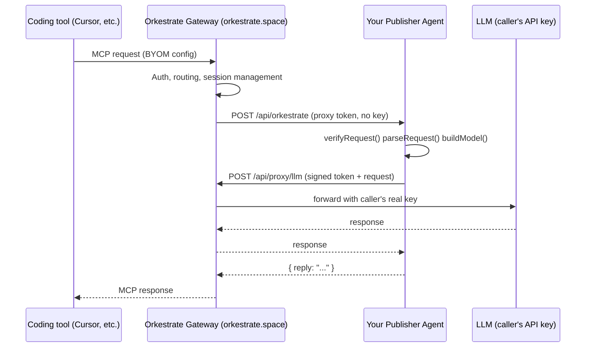

# @orkestrate/sdk

The official SDK for building Orkestrate publisher agents.

[](https://www.npmjs.com/package/@orkestrate/sdk)
[](LICENSE)
[](https://github.com/system1970/orkestrate-sdk/actions/workflows/ci.yml)

---

## What is Orkestrate?

[Orkestrate](https://orkestrate.space) is an AI agent gateway. Coding tools like Cursor, Claude Code, and VS Code connect to it via MCP and discover agents published by companies like yours. Callers bring their own model (BYOM) — you just handle the turn.

<picture>
  <source media="(prefers-color-scheme: dark)" srcset="https://mermaid.ink/svg/c2VxdWVuY2VEaWFncmFtCiAgICBwYXJ0aWNpcGFudCBDb2RlciBhcyBDb2RpbmcgdG9vbCAoQ3Vyc29yLCBldGMuKQogICAgcGFydGljaXBhbnQgR1cgYXMgT3JrZXN0cmF0ZSBHYXRld2F5IChvcmtlc3RyYXRlLnNwYWNlKQogICAgcGFydGljaXBhbnQgQWdlbnQgYXMgWW91ciBQdWJsaXNoZXIgQWdlbnQKICAgIHBhcnRpY2lwYW50IExMTSBhcyBMTE0gKGNhbGxlcidzIEFQSSBrZXkpCgogICAgQ29kZXItPj5HVzogTUNQIHJlcXVlc3QgKEJZT00gY29uZmlnKQogICAgR1ctPj5HVzogQXV0aCwgcm91dGluZywgc2Vzc2lvbiBtYW5hZ2VtZW50CiAgICBHVy0-PkFnZW50OiBQT1NUIC9hcGkvb3JrZXN0cmF0ZSAocHJveHkgdG9rZW4sIG5vIGtleSkKICAgIEFnZW50LT4-QWdlbnQ6IHZlcmlmeVJlcXVlc3QoKSBwYXJzZVJlcXVlc3QoKSBidWlsZE1vZGVsKCkKICAgIEFnZW50LT4-R1c6IFBPU1QgL2FwaS9wcm94eS9sbG0gKHNpZ25lZCB0b2tlbiArIHJlcXVlc3QpCiAgICBHVy0-PkxMTTogZm9yd2FyZCB3aXRoIGNhbGxlcidzIHJlYWwga2V5CiAgICBMTE0tLT4-R1c6IHJlc3BvbnNlCiAgICBHVy0tPj5BZ2VudDogcmVzcG9uc2UKICAgIEFnZW50LS0-PkdXOiB7IHJlcGx5OiAiLi4uIiB9CiAgICBHVy0tPj5Db2RlcjogTUNQIHJlc3BvbnNl?theme=dark">
  
</picture>

<details>
<summary>Diagram source (Mermaid)</summary>



</details>

You deploy a single HTTP endpoint. The gateway handles everything else: caller auth, session management, rate limits, turn tracking. Your job is one function: receive a message, run your agent, return a reply.

## Why use this SDK?

- **Caller's API key never reaches your server.** LLM calls are proxied through the gateway with scoped tokens. No key logging, no exfiltration.
- **No session infrastructure to build.** Gateway mints session ids, enforces TTLs, stores history.
- **One import, any framework.** Primitives for bare-bones handlers, convenience wrapper for AI SDK users.
- **BYOM works out of the box.** OpenAI, Anthropic, Google, or any OpenAI-compatible provider.

## Install

```bash
npm install @orkestrate/sdk ai
```

`ai` (Vercel AI SDK) is a peer dependency — required for `buildModel` and `createOrkestrateHandler`. If you only use `verifyRequest` and `parseRequest`, you can ignore the peer dep warning.

## Quick start

### Primitives (any framework)

```ts
import { verifyRequest, parseRequest, buildModel, respond } from "@orkestrate/sdk";

async function handler(request: Request) {
  verifyRequest(request, process.env.ORKESTRATE_SECRET!);
  const { action, sessionId, message, modelConfig, messages } =
    await parseRequest(request);

  switch (action) {
    case "ping":
    case "end_session":
      return respond.ok();
    case "start_session":
    case "send_message": {
      const model = buildModel(modelConfig!);
      const reply = await runAgent({ message: message!, model, sessionId, messages: messages! });
      return respond.reply(reply);
    }
  }
}
```

### AI SDK convenience wrapper

```ts
import { createOrkestrateHandler } from "@orkestrate/sdk";
import { generateText } from "ai";

export const { GET, POST } = createOrkestrateHandler({
  secret: process.env.ORKESTRATE_SECRET!,
  async onTurn({ message, model, messages, callerId }) {
    const result = await generateText({ model, messages });
    return { reply: result.text };
  },
});
```

### Complete working example (Next.js)

```ts
// app/api/orkestrate/route.ts  ← must match gateway's path
import { createOrkestrateHandler } from "@orkestrate/sdk";
import { generateText } from "ai";

export const { GET, POST } = createOrkestrateHandler({
  secret: process.env.ORKESTRATE_SECRET!,

  async onTurn({ message, model, messages, callerId }) {
    const { text } = await generateText({
      model,
      messages,
      system: "You are a helpful product agent.",
    });
    return { reply: text };
  },
});
```

Deploy this to Vercel, register your domain at [orkestrate.space](https://orkestrate.space), and you're live. The gateway calls `https://<your-domain>/api/orkestrate`.

## API

### `verifyRequest(request, secret)`

Authenticates the gateway request via `Authorization: Bearer <secret>`.  
Throws `OrkestrateError("UNAUTHORIZED")` on failure.

### `parseRequest(request)`

Decodes gateway headers + body into a typed `ParsedRequest`:

| Field | Source | Description |
|-------|--------|-------------|
| `action` | `X-Orkestrate-Action` | `start_session` / `send_message` / `end_session` / `ping` |
| `sessionId` | `X-Orkestrate-Session-Id` | Gateway-minted session id |
| `callerId` | `X-Orkestrate-Caller-Id` | Opaque caller identifier (optional) |
| `modelConfig` | `X-Orkestrate-Model` | Base64url JSON — provider, model, baseURL?, gatewayUrl, token |
| `message` | body | Latest user message text |
| `messages` | body | Full conversation history |

### `buildModel(config)`

Constructs an AI SDK `LanguageModel` from the caller's BYOM config.

Supports: `openai` · `anthropic` · `google` · `custom` (OpenAI-compatible)

### `respond`

| Method | Returns |
|--------|---------|
| `respond.ok(extra?)` | `{ ok: true }` — ping, end_session |
| `respond.reply(text)` | `{ reply: "..." }` — agent response |
| `respond.error(code, message, status?)` | `{ error: { code, message } }` — typed error |

### `createOrkestrateHandler(options)`

Convenience wrapper for AI SDK users. Returns `{ GET, POST }` handlers.

Options: `{ secret, onTurn: (ctx: TurnContext) => TurnResult, onClose?: (ctx: CloseContext) => void }`

## Wire protocol

| Header | When |
|--------|------|
| `Authorization: Bearer <secret>` | all POST requests |
| `X-Orkestrate-Action` | `start_session` / `send_message` / `end_session` / `ping` |
| `X-Orkestrate-Session-Id` | open / send / close |
| `X-Orkestrate-Model` | open / send — base64url JSON |
| `X-Orkestrate-Caller-Id` | optional — opaque caller identity |

## Error codes

| Code | HTTP | Meaning |
|------|------|---------|
| `UNAUTHORIZED` | 401 | Bad or missing `Authorization` |
| `BAD_REQUEST` | 400 | Missing header, invalid body, bad model config |
| `MODEL_ERROR` | 400 | `buildModel` rejected the config |
| `SESSION_NOT_FOUND` | 500 | Session id does not exist |
| `SESSION_EXPIRED` | 500 | Session idle or hard TTL |
| `SESSION_STALE` | 500 | Session data is stale |
| `CONFLICT` | 500 | Concurrent operation on the same session |
| `LIMIT_EXCEEDED` | 500 | Turn or rate limit hit |
| `INTERNAL` | 500 | `onTurn` threw or returned empty reply |

## Limitations

| Limitation | Details |
|------------|---------|
| **No streaming** | V1 is text-turn only. SSE streaming is planned. |
| **`custom` provider** | Assumes OpenAI-compatible `/chat/completions` API. Works with Ollama, vLLM, etc. |
| **Bundle size** | Includes `@ai-sdk/openai`, `@ai-sdk/anthropic`, and `@ai-sdk/google` regardless of which provider you use. |

## What the gateway handles (not in this SDK)

The gateway — not this SDK — manages session storage, conversation history persistence, rate limiting, idle timeout, absolute TTL, concurrent session limits, and caller authentication. You just handle turns.

## Learn more

- [orkestrate.space](https://orkestrate.space) — the gateway
- [Documentation](https://orkestrate.space/docs) — caller & publisher guides

## License

MIT
